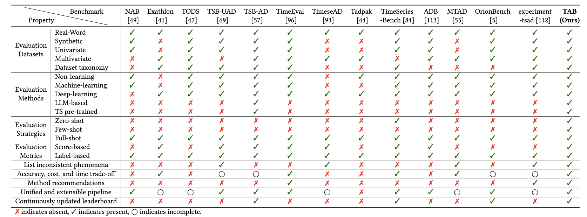

# TAB: Unified Benchmarking of Time Series Anomaly Detection Methods

## Introduction

TAB is an open-source library designed for time series anomaly detection researchers.

We provide a clean codebase for end-to-end evaluation of time series anomaly detection models, comparing their performance with baseline algorithms under various evaluation strategies and metrics.

The below figure provides a visual overview of TAB's pipeline.

<div style="text-align: center;">
    
</div>


The table below provides a visual overview of how TAB's key features compare to other libraries for time series anomaly detection.

<div style="text-align: center;">
    
</div>

## Quickstart

### Installation
Follow the steps below to configure the TAB environment.
#### 1. Install Git
Some models require Git to run. Please ensure that Git is installed on your system. If not, you can install it using the following command:
```shell
sudo apt-get install git
```
#### 2. Download and Extract Environment
Download the environment from [OneDrive](https://1drv.ms/u/c/801ce36c4ff3f93b/Eapc8wI7tqxOqmOPZ66uMG4BgeX8j7AewKq7NekCI0Al2w?e=NdenlL). (This may take some time, please wait patiently.) Then, create a directory my_env (we recommend creating it under `conda/envs/`) and extract the environment into this directory:
```shell
mkdir -p my_env
tar -xzf CATCH.tar.gz -C my_env
```
#### 3. Activate the Environment
```shell
source my_env/bin/activate
```
#### 4. Clean Environment Prefix
You can clear the environment prefix using the following command. Now the environment is the same as one created directly with conda at this path:
```shell
(my_env) $ conda-unpack
```

### Data preparation

Prepare Data. You can obtained the well pre-processed datasets from [Google Drive](https://drive.google.com/file/d/1oHDHKCGMT_xkHhCI113bQ-4IzGnKPU3I/view?usp=drive_link). Then place the downloaded data under the folder `./dataset`. 

### Train and evaluate model

We provide the experiment scripts for all benchmarks under the folder `./scripts/multivariate_detection`, and `./scripts/univariate_detection`. For example you can reproduce a experiment result as the following:

```shell
sh ./scripts/multivariate_detection/detect_label/MSL_script/ModernTCN.sh
```